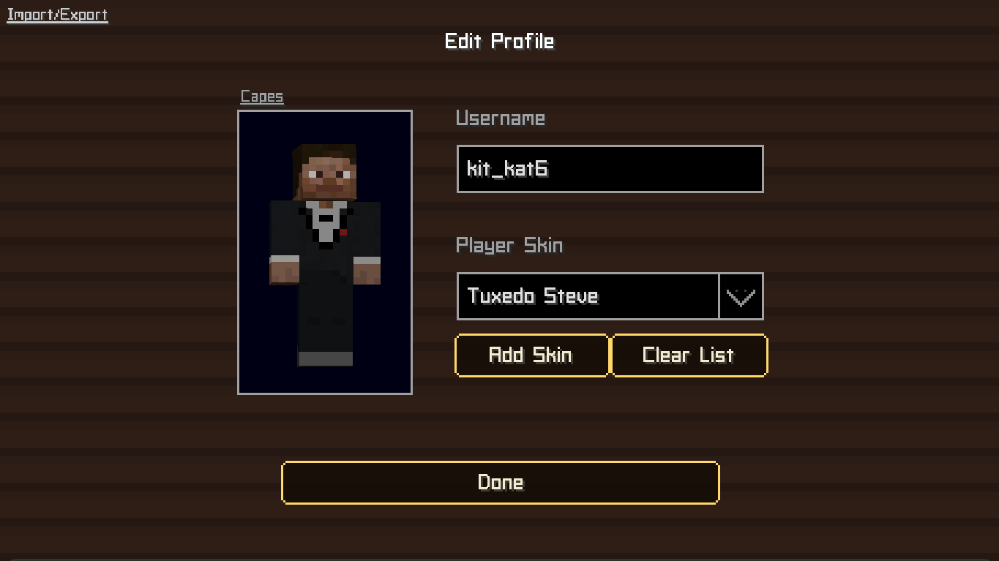

<h1>1.</h1>
<h3>Begin by going to one of the treasure client files</h3>
<h3>once at the chosen file select the button in the top right</h3>

<h1>2.</h1>
<h3>Once you have downloaded the file go to your file explorer and run the treasure client file</h3>

<h2>preview:</h2>

